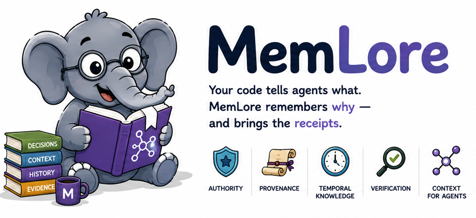

<p align="center">
  
</p>

# MemLore

<p align="center">
  <a href="https://go.dev/"></a>
  <a href="https://www.postgresql.org/"></a>
  <a href="https://neo4j.com/"></a>
  <a href="https://github.com/getzep/graphiti"></a>
  <a href="https://modelcontextprotocol.io/"></a>
  
  <a href="#license"></a>
</p>

The engineering intelligence layer that makes every coding agent understand
how your team actually builds software.

MemLore preserves the *why* behind the code: architectural decisions, engineering
context, provenance, authority, temporal history, conflicts, superseded
knowledge, and agent observations — so coding agents retrieve trustworthy
context with evidence, not just similar text.

## Why MemLore?

Generic AI memory stores embeddings and snippets. Engineering work needs more:

```text
Generic memory → "I remember something."

MemLore → "I know what your team decided, why they decided it,
whether it's still true, what code implements it, what contradicts
it, and what this agent needs to know right now."
```

- **Provenance** — who said it, human or agent, with evidence
- **Authority** — verified architecture outranks unverified inference
- **Temporal truth** — supersede facts without erasing history
- **Conflicts** — surface drift between policy and implementation
- **Scopes** — organization → team → project → repository → task
- **Decisions** — first-class rationale, not generic memories (F040)
- **Drift** — intent vs implementation in the PR loop (roadmap F050)

## Quick start

Requirements: Go 1.25+, Docker / Docker Compose. Python 3.12 + [uv](https://docs.astral.sh/uv/)
only if you run `graph-service/`.

```bash
cp .env.example .env
docker compose up -d postgres
./scripts/install-memlore.sh
./bin/memlore migrate
./bin/memlore serve
```

Health check: `GET http://127.0.0.1:8080/health`

## Connect a coding agent

Start the stdio MCP server (Postgres must be up and migrated):

```bash
./bin/memlore mcp
```

Tools: `memlore.remember`, `get`, `verify`, `explain`, `search`,
`knowledge_search`, `get_for_task`, `repo_profile`, `supersede`, `invalidate`.
Mutating tools require `actor_id` in local mode (OIDC optional).
See [docs/api/mcp.md](docs/api/mcp.md).

## CLI

```bash
./bin/memlore serve     # REST on :8080
./bin/memlore mcp       # stdio MCP
./bin/memlore profile --repository <key>  # repository intelligence briefing
./bin/memlore context --task <text> --repository <key>  # task context packet
./bin/memlore ingest git --repository <key> --path <dir> [--actor <id>]
./bin/memlore ingest pr --repository <key> [--pr <n>] [--actor <id>]
./bin/memlore ingest adr --repository <key> --path <dir> [--adr-dir <rel>] [--actor <id>]
./bin/memlore ingest status --repository <key> [--kind git|pr|adr]
./bin/memlore review list --repository <key>
./bin/memlore review accept <id> [--statement <text>] [--actor <id>]
./bin/memlore review reject <id> [--actor <id>]
./bin/memlore migrate   # goose (embedded)
./bin/memlore worker    # outbox → graph-service
```

Or `go run ./cmd/memlore <command>` from this repo.

## Documentation

| Area | Link |
|------|------|
| Architecture overview | [docs/architecture/overview.md](docs/architecture/overview.md) |
| Product feature roadmap | [docs/development/FEATURE_DEVELOPMENT.md](docs/development/FEATURE_DEVELOPMENT.md) |
| ADRs | [docs/adr/](docs/adr/) |
| Development setup | [docs/development/setup.md](docs/development/setup.md) |
| TDD | [docs/development/tdd.md](docs/development/tdd.md) |
| Constitution | [.specify/memory/constitution.md](.specify/memory/constitution.md) |

## Status

MemLore Core is **Go** (REST, MCP, migrations, worker, authority, lifecycle,
OIDC/RBAC). Knowledge plane is a thin Python **graph-service** (Graphiti/Neo4j).
Foundation (v0.8.0) is complete. F020 repository intelligence profile, F021
agent context bootstrap (`get_for_task` named packet, `memlore context`),
F030 git / F031 PR / F032 ADR ingest, and F035 suggested-lore review
(`memlore review`) are available. Next: **F040** first-class decision model
or **F022** packet profiles — see the
[feature roadmap](docs/development/FEATURE_DEVELOPMENT.md).

## License

Licensed under the [Apache License, Version 2.0](LICENSE).
See [ADR 0006](docs/adr/0006-apache-2-0-license.md).
